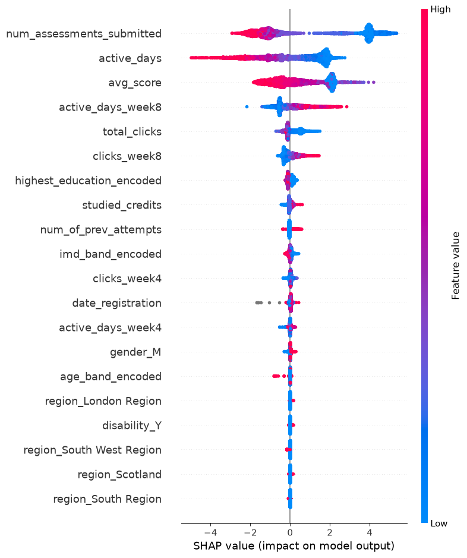

# Early Risk Detection for Student Success (OULAD)

A machine learning case study that flags students at risk of failing or withdrawing early enough for academic advisors to intervene. Built on the Open University Learning Analytics Dataset (OULAD).

## Problem

Online learning institutions often discover struggling students only after a missed assignment or failed exam, when little time remains to help. This project builds a model that predicts risk early using enrollment, demographic, assessment, and engagement data, and explains why each student was flagged so advisors can offer targeted support.

## Dataset

[OULAD](https://analyse.kmi.open.ac.uk/open_dataset): 7 linked tables covering around 32,600 students across multiple course modules, including demographics, registration and withdrawal dates, assessment results, and daily VLE (Virtual Learning Environment) activity logs.

## Data Cleaning & Merging

- Combined all 7 tables into a single student-level record (32,593 rows, 31 features), keyed on `id_student`, `code_module`, and `code_presentation`.
- Large tables (`studentAssessment`, `studentVle`, 10.6M rows) were aggregated to one row per student before merging, to avoid row explosion.
- Key cleaning decisions:
  - `imd_band`: fixed an inconsistent category label (`"10-20"` to `"10-20%"`), missing values labeled `"Unknown"`.
  - `date_unregistration` (69% missing): left as NaN. The missingness is structural, since students who never withdrew have no withdrawal date, confirmed against `final_result` counts.
  - 173 rows with a missing `score` (no explainable pattern) were dropped (under 0.1% of data).
  - Discovered that students with unusually high `studied_credits` (above 300) withdraw at a 71% rate, compared to a 31% baseline withdrawal rate. This is a strong early signal of overload.

## Feature Engineering

- Target: simplified `final_result` (4 classes) into a binary `at_risk` flag. Fail or Withdrawn equals 1, Pass or Distinction equals 0 (around 53%/47%, near-balanced).
- Encoding: ordinal encoding for ordered categories (`age_band`, `highest_education`, `imd_band`), one-hot encoding for nominal categories (`gender`, `region`, `disability`).
- Early-detection features: VLE activity re-aggregated into time windows (first 4 and first 8 weeks) to test how early the model can flag risk, not just total-course activity.

## Model Comparison

| Model | F1-Score | Precision | Recall |
|---|---|---|---|
| Logistic Regression (baseline) | 0.90 | 0.92 | 0.88 |
| XGBoost (ensemble) | 0.92 | 0.95 | 0.88 |

Given the near-balanced target, F1, Precision, and Recall were prioritized over raw accuracy. XGBoost improved mainly on precision (fewer false alarms) while matching the baseline's recall. This suggests the engineered features carry a strong, largely linear signal, with the ensemble refining the decision boundary rather than uncovering entirely new patterns.

## Interpretability (SHAP)

Top predictive features are `num_assessments_submitted`, `active_days`, `avg_score`, and early-window activity (`active_days_week8`). Submitting fewer assessments and lower site engagement strongly push predictions toward "at risk." Demographic features such as region, gender, and disability had comparatively minimal influence.

## Key Insights & Recommendations

- Engagement, not demographics, drives risk. Behavioral signals (submissions, clicks, active days) far outweigh demographic factors, so interventions should be triggered by activity drops, not student profile.
- Early-window activity (first 8 weeks) is already predictive, so advisors can act well before the course midpoint.
- High course load (above 300 study credits) correlates with roughly twice the withdrawal rate. This is a simple, actionable flag for advisors.
- Missed assessments are the single strongest warning sign. A student submitting zero assessments by week 8 warrants immediate outreach.

## Limitations & Future Work

- Assessment scores were averaged with equal weighting. A weighted average using each assessment's `weight` could better reflect final-exam performance.
- Only two time windows (4 and 8 weeks) were tested. A sliding-window analysis could pinpoint the earliest reliable detection point more precisely.

## Tech Stack

Python, pandas, scikit-learn, XGBoost, SHAP

## Project Structure

- `early_detection.ipynb`: full analysis (cleaning, merging, modeling, SHAP)
- `oulad_final_features.csv`: cleaned, feature-engineered dataset
- `shap_summary.png`: SHAP summary plot
- `README.md`: this file
